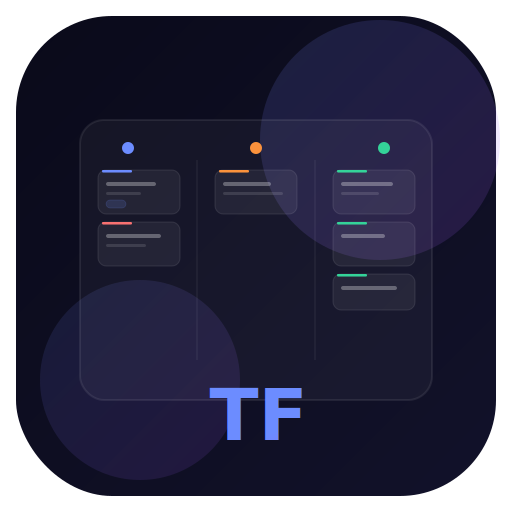

# TaskFlow

A beautiful glassmorphism task management dashboard built with Electron.



## Features

- **Kanban Board** — Organize tasks in Pending, In Progress, and Done columns
- **Drag & Drop** — Move tasks between columns effortlessly
- **Subtasks** — Break down tasks into smaller, trackable steps
- **Tags & Priorities** — Categorize with custom colored tags and priority levels (Low → Critical)
- **Due Dates** — Track deadlines with visual overdue/soon indicators
- **Search & Filters** — Find tasks instantly with Ctrl+K, filter by priority or tag
- **Bulk Operations** — Select multiple tasks to move or delete at once
- **Analytics Dashboard** — Weekly activity chart, distribution donut, streak tracker, tag breakdown
- **Timeline View** — See all tasks ordered by due date
- **6 Themes** — Midnight, Ocean, Aurora, Sunset, Rosé, and Snow (light mode)
- **Custom Tags** — Create your own tags with a color picker
- **Data Export/Import** — Back up and restore your tasks as JSON
- **Offline First** — All fonts and icons bundled locally, works without internet
- **Beautiful UI** — Glassmorphism design with smooth animations

## Getting Started

### Prerequisites

- [Node.js](https://nodejs.org/) (v18 or later)
- npm (comes with Node.js)

### Install Dependencies

```bash
npm install
```

### Run in Development

```bash
npm start
```

### Build Installer

```bash
# Windows installer (.exe)
npm run build

# Portable version (no installation required)
npm run build:portable
```

The installer will be generated in the `dist/` folder.

## Tech Stack

- **Electron** — Cross-platform desktop framework
- **Vanilla JS** — No frontend framework dependencies
- **CSS3** — Glassmorphism, custom properties, animations
- **Inter Font** — Clean, modern typography
- **Remix Icon** — Beautiful icon set

## Keyboard Shortcuts

| Shortcut | Action |
|----------|--------|
| `Ctrl+K` | Focus search |
| `Escape` | Close modals |

## Data Storage

Tasks are stored locally in your system's app data folder:
- **Windows:** `%APPDATA%/taskflow/tasks.json`
- **macOS:** `~/Library/Application Support/taskflow/tasks.json`
- **Linux:** `~/.config/taskflow/tasks.json`

## License

[MIT](LICENSE) — Cassiano Alves
